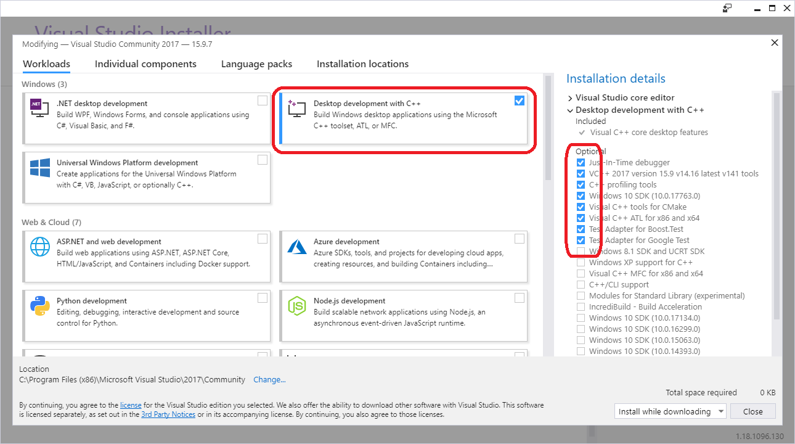

# edk2-UDK2018

## Goal
Get the MinnowBoard running with UDK2018.
NOTE: Visual Studio is here only used for editing the project.
The build process is pure EDK!

## HowTo
1. download and install https://www.python.org/ftp/python/2.7/python-2.7.amd64.msi
   at c:\Python27
2. download and install https://www.nasm.us/pub/nasm/releasebuilds/2.13/win64/nasm-2.13-installer-x64.exe
   at c:\NASM
3. download VS12017 from here: https://visualstudio.microsoft.com/downloads/
4. select: "Desktop development with C++"
		
5. after installation is finished, open _edk2-vUDK2018.sln_

## Revision history
### 20190216/4 - bugfix, update
